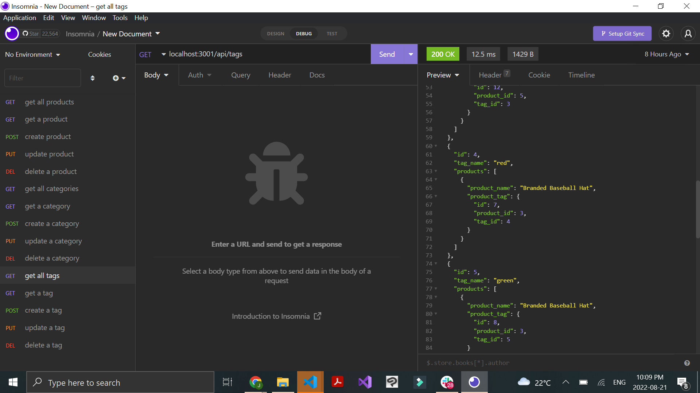

# profile-generator
  
## Description

Manage an ecommerce store with backend CRUD operations that allows you to manipulate products, tags and categories.

## Technologoies
- Sequelize
- MySQL
- Node
- Express
- DotEnv

## Installation

To install, clone the file. Make sure you have Node.js, Sequelize, MySQL, Express and DotEnv downloaded to proceed.

## Contributing

Please feel free to suggest ways to make this project MORE than amazing!!

## Tests

To test the product, run the file in your terminal with the command "npm start" and use your API client of choice to test the product, tag and category routes.

## Questions

Please reach out with questions via GitHub or email:
- www.github.com/gitJanaeW
- janae.wel@gmail.com

